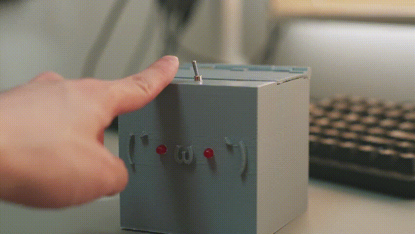
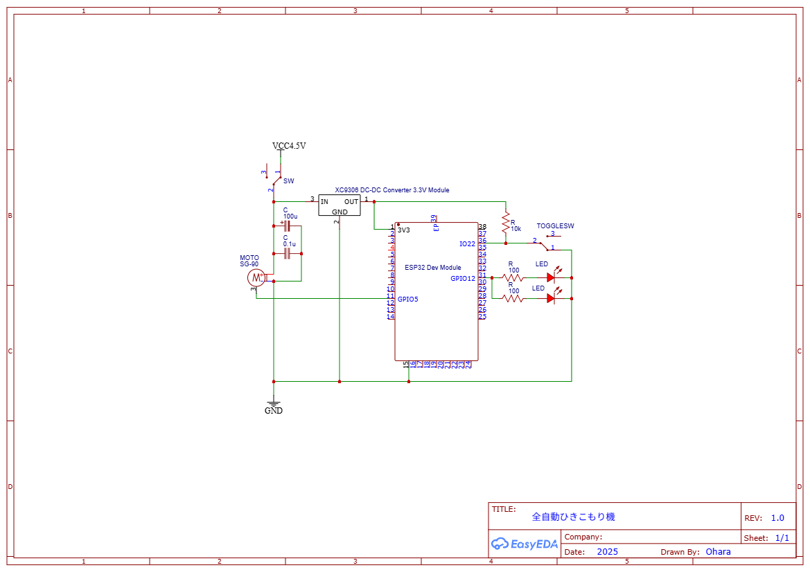
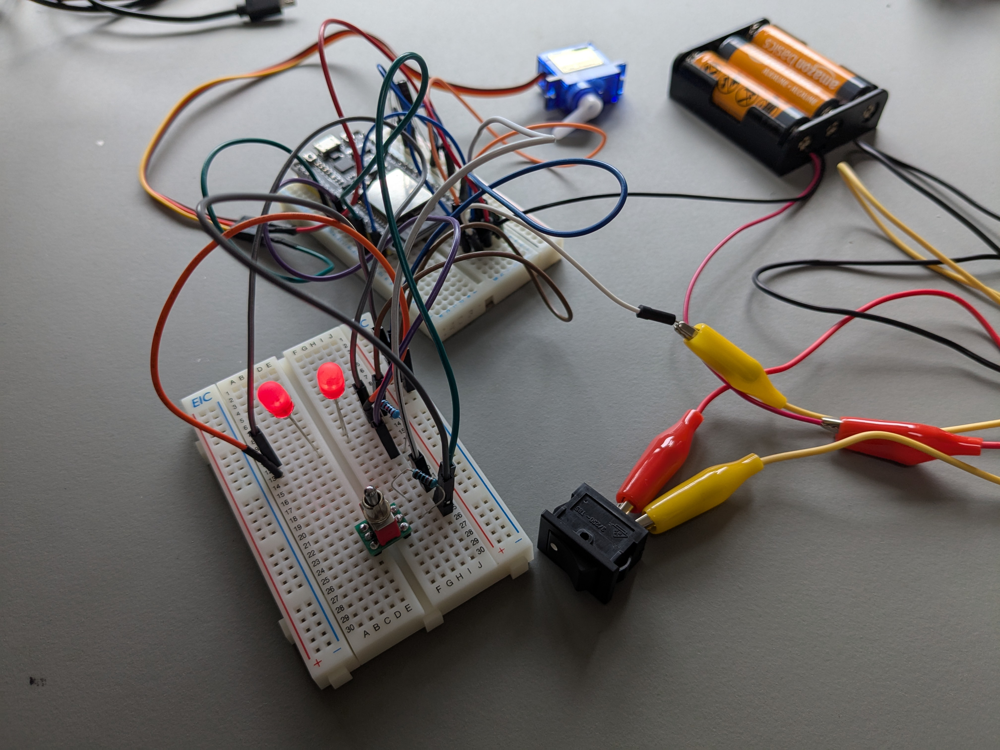
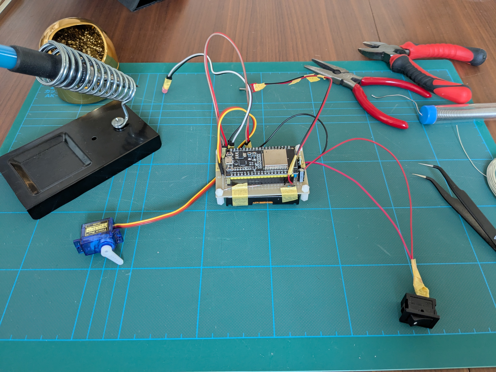
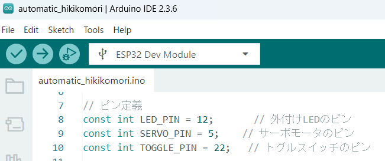
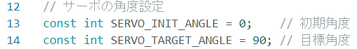
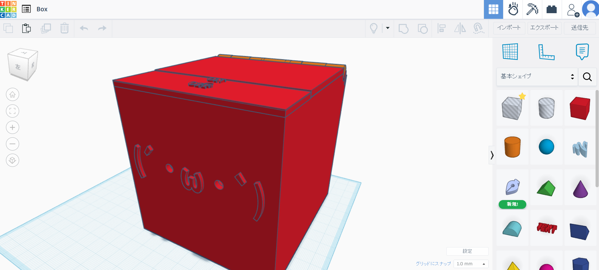
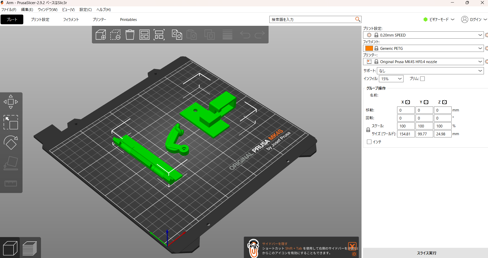
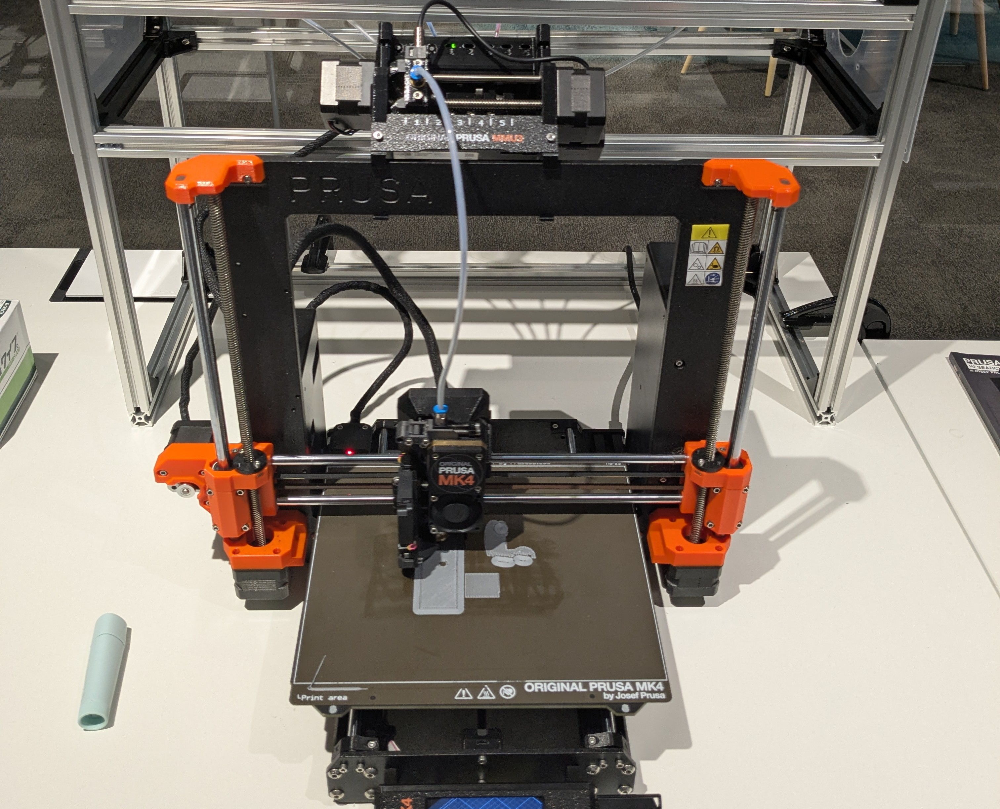
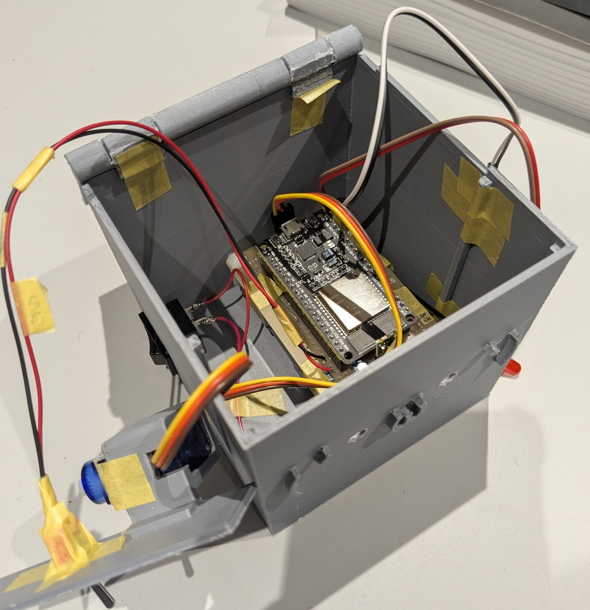

# Self-Automated Hikikomori（自動ひきこもり機）

## 1. 概要

スイッチを ON にすると、自動で OFF にしてくるロボットです。
[Youtube](https://youtu.be/gk-dLM3qwz0)

以下の動画を参考にしました。

- [参考 1](https://www.youtube.com/watch?v=apVR5Htz0K4&list=WL&index=51&ab_channel=JeffreyKohler)
- [参考 2](https://www.youtube.com/watch?v=fkaciOzu7uY&list=PLSyqxLX5bFDtI-OYhptbLNl8_eLKO6vTg&ab_channel=MyCraftRoom)

## 2. 作り方

### 2-1. 回路

回路図は `Circuit/Schematic_automatic_hikikomori.png` の通りです。

物品リストは下記の通りです。

- ESP32 Dev Module
- [ピンソケット (メス) 1×20 (20P) **２個**：ESP32 用](https://akizukidenshi.com/catalog/g/g103077/)
- [マイクロサーボ 9g SG-90](https://akizukidenshi.com/catalog/g/g108761/)
- [XC9306 使用 同期整流昇降圧 DCDC コンバーターキット 3.3V 版](https://akizukidenshi.com/catalog/g/g116055/)
- [ピンソケット(メス) 1×3(3P)：コンバータ用](https://akizukidenshi.com/catalog/g/g110098/)
- [電解コンデンサー 100μF16V105℃ ルビコン PX](https://akizukidenshi.com/catalog/g/g110271/)
- [積層セラミックコンデンサー 0.1μF250V X7R](https://akizukidenshi.com/catalog/g/g110147/)
- [波動スイッチ DS-850K-S-WD](https://akizukidenshi.com/catalog/g/g115739/)
- [電池ボックス 単 3×3 本 リード線](https://akizukidenshi.com/catalog/g/g102667/)
  - 単三電池も用意する
- [基板用小型 3P トグルスイッチ 1 回路 2 接点](https://akizukidenshi.com/catalog/g/g102399/)
- [5mm 赤色 LED 625nm OSR5JA5E34B **2 個**](https://akizukidenshi.com/catalog/g/g112605/)
  - 好みで拡散キャップ
- 抵抗
  - 10KΩ 1 個
  - 100Ω 2 個

> ※その他、必要に応じてブレッドボードやユニバーサル基板、はんだ付け用物品等を用意してください。

ユニバーサル基板ではんだ付けする前に、ブレッドボード上で確認することをお勧めします。

### 2-2. プログラム

プログラムは `ESP32/automatic_hikikomori/automatic_hikikomori.ino` の通りです。

2-1 の回路で使用するピンに合わせて定義を修正してください。

また、実環境合わせてサーボモータの角度も調整してください。

ESP32 用 Aruduino IDE 環境のセットアップは下記を参考にしました。
[ESP32 の Arduino 開発環境をつくりました（おおた fab 電子工作初心者勉強会）](https://kanpapa.com/today/2022/12/esp32-otafab-study-arduino.html)
[Arduino IDE 2.x で ESP32 がポートを認識しないときは、VCP ドライバをインストールする](https://www.ekit-tech.com/?p=8213)

### 2-3. 3D プリンタ

3D プリンタ用 CAD データは下記の通りです。

1. `3D Printer\STL`：3D CAD STL 形式データ(Thinkercad で作成)
   
2. `3D Printer\PrusaSlicer`：Original Prusa プリンタ用プロジェクトファイル(Prusa mini を使用)
   
3. `3D Printer\G file`：PrusaSlicer からエクスポートしたデータ
   本データを下記プリンタに読み込ませて印刷
   

### 2-4. 組み立て

